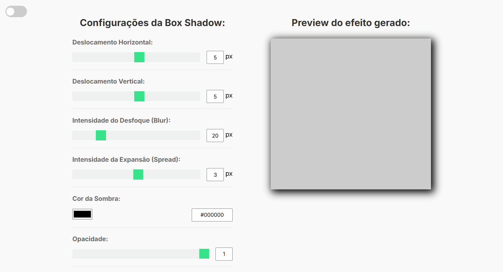

# 🌟 Box Shadow Generator

 

    <h2>🎯 Sobre o Projeto</h2>
    Este projeto é um gerador de sombras com controle sobre diversos parâmetros, desenvolvido em JavaScript. Ele permite ajustar e visualizar em tempo real as sombras aplicadas a uma caixa de pré-visualização, além de copiar a regra CSS gerada.

 

## 👨🏾‍💻 Principais Funcionalidades 
 
<ul>
  <li><strong>Ajuste de sombra</strong>: controle sobre a posição horizontal e vertical, o desfoque, a expansão, a cor e a opacidade da sombra.</li>
  <li><strong>Modo inset</strong>: possibilidade de alternar entre sombra interna e externa.</li>
  <li><strong>Preview em tempo real</strong>: a sombra é exibida em tempo real em uma caixa de pré-visualização.</li>
  <li><strong>Exibição e cópia da regra CSS</strong>: o código gerado para o box-shadow pode ser facilmente copiado.</li>
  <li><strong>Modo Escuro</strong>: alternância entre modo claro e escuro, com a preferência salva no Local Storage.</li>
</ul>

## 📸 Screenshots

  

 

## 🏆 Aprendizados 

- **Manipulação do DOM**: Seleção e atualização de valores diretamente nos elementos HTML para sincronizar com o preview.
- **Função de Conversão de Cor**: Transformação de cores hexadecimais em RGB para criar sombras com opacidade ajustável.
- **Eventos de Input e Click**: Uso de eventos `input` e `click` para ajustar parâmetros e alternar o modo escuro.
- **Local Storage**: Armazenamento do tema escolhido pelo usuário, aplicando-o automaticamente ao recarregar a página.
- **Copiar para Clipboard**: Implementação de função para copiar a regra CSS da sombra gerada.
- **Criação de Classe Customizada**: Organização do código em uma classe `BoxShadowGenerator`, promovendo reutilização e modularidade do código.

 

## 🚀 Tecnologias Utilizadas

- JavaScript
- HTML5
- CSS3

 

## 🔗 Projeto On-line
Este projeto está disponível para visualização on-line.  
Você pode acessá-lo através do link: https://todo-list-advanced-henna.vercel.app/

 

##

    Este projeto foi desenvolvido como parte do curso <strong>Formação Front-end - HTML, CSS, JavaScript, React e +</strong>, ministrado por <strong>Matheus Battisti</strong> da Escola de Programação <strong>🕒 Hora de Codar</strong>.

